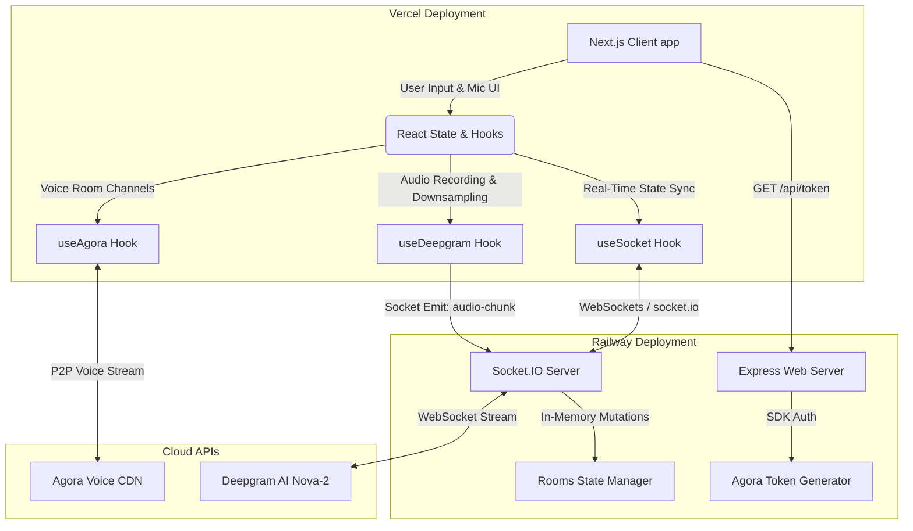

# LiveRoom — System Architecture & Data Flow

Welcome to the **LiveRoom** architecture guide. LiveRoom is a real-time collaborative voice chat application equipped with continuous, low-latency, AI-powered transcription.

This document describes the high-level system design, service communication layers, state synchronization mechanisms, and deployment blueprints of the application.

---

## 1. High-Level System Topology

LiveRoom is a multi-tier, real-time application split into a client-side web application and a server-side orchestrator/signaling proxy.



---

## 2. Component Directory Structure

### 📂 Client (`/client`)
Built using **Next.js 16 (App Router)** and styled with custom modern Tailwind CSS styling:
*   **[page.tsx](file:///client/src/app/page.tsx)**: Main controller. Coordinates session status, React state, and hooks orchestration.
*   **[types.ts](file:///client/src/types.ts)**: Shared TypeScript interfaces for `RoomUser`, `TranscriptEntry`, and `RoomState`.
*   **Hooks (`/client/src/hooks`)**:
    *   **[useSocket.ts](file:///client/src/hooks/useSocket.ts)**: Client for real-time room synchronization, custom message/speaking triggers, and room status updates over Socket.IO.
    *   **[useAgora.ts](file:///client/src/hooks/useAgora.ts)**: Custom wrapper around the `agora-rtc-sdk-ng` for low-latency peer-to-peer voice communications.
    *   **[useDeepgram.ts](file:///client/src/hooks/useDeepgram.ts)**: Raw Audio capture hook. Collects local microphone stream, downsamples floats to 16-bit linear PCM (`Int16Array`), and pipes it to the Socket server.
*   **Components (`/client/src/components`)**:
    *   **[Lobby.tsx](file:///client/src/components/Lobby.tsx)**: Entrance interface featuring credentials login and room builder.
    *   **[RoomPage.tsx](file:///client/src/components/RoomPage.tsx)**: Dash board grid splitting the viewport between participant list and active transcripts.
    *   **[UserList.tsx](file:///client/src/components/UserList.tsx)**: Sidebar visualizer tracking current participant statuses, mute states, and live speaking animations.
    *   **[TranscriptPanel.tsx](file:///client/src/components/TranscriptPanel.tsx)**: Real-time scrolling visualizer displaying finalized and stream-in-progress (partial) text bubbles.
    *   **[MuteButton.tsx](file:///client/src/components/MuteButton.tsx)**: Glowing state-managed button utilizing safe soft-mute commands.
    *   **[ConnectionStatus.tsx](file:///client/src/components/ConnectionStatus.tsx)**: Live connectivity grid tracking Socket, Agora, and Deepgram states.

### 📂 Server (`/server`)
A persistent **Node.js Express / Socket.IO** server:
*   **[index.js](file:///server/index.js)**: Entry point. Hosts signaling, handles Socket sessions, acts as a **Secure Deepgram WebSockets Audio Proxy**, and generates secure token payloads.
*   **[rooms.js](file:///server/rooms.js)**: High-performance in-memory room manager using ES6 `Map` objects. Operates all mutations (users joining, toggling mute, adding chat transcripts).

---

## 3. Core Pipelines & Data Flow

### A. The Room Establishment & Voice Signaling Flow
```
[Client App]             [Railway Server]            [Agora CDN]
     |                           |                        |
     |---- 1. Join Room ------>|                        |
     |                         |-- 2. Update state --|    |
     |                         |<-- & Broadcast -----|    |
     |                           |                        |
     |---- 3. Fetch Token ------>| (Generate token)       |
     |<--- 4. RTC Token ---------|                        |
     |                                                    |
     |---- 5. Join Channel (AppID + Token) -------------->|
     |<--- 6. Establish Audio Stream ---------------------|
```
1.  **Join Request**: A participant enters the lobby, choosing a nickname and a Room ID. The client sends the Socket event `join-room`.
2.  **State Upgrades**: The server executes `joinRoom` within `rooms.js`, assigns a Socket session ID, registers the default participant state, and broadcasts the updated `room-state` snapshot to all room sockets.
3.  **Secure Credentials Handshake**: Rather than exposing high-security Agora certificates on the web, the client issues a backend token request:
    `GET http://<railway-url>/api/token?channelName=<room-id>`
4.  **Token Generation**: The server reads `AGORA_APP_CERTIFICATE` and generates a temporary privilege-checked RTC token using the `agora-access-token` builder, returning it as a JSON payload.
5.  **Channel Entry**: The client dynamically instantiates `AgoraRTC`, joins the respective channel, and publishes the microphone track. Other clients automatically subscribe to this user's voice track, playing it over standard browser audio channels.

---

## 4. The Mobile-Resilient Voice Transcription Pipeline

Establishing reliable real-time AI transcription on mobile and desktop browsers requires bypassing hardware and browser sandboxing limitations. The application implements a highly robust **"Hot-Swapping" persistent audio graph architecture**:

```
 [Microphone Stream] -> [Persistent AudioContext] -> [ScriptProcessorNode]
                                                           |
                                                (Convert to 16-bit Int)
                                                           |
                                               [ArrayBuffer audio-chunk]
                                                           |
                                                    (Socket.IO Emit)
                                                           v
                                                [Railway Server Gateway]
                                                           |
                                               (Proxy to Deepgram SDK)
                                                           v
                                                [Deepgram Nova-2 AI]
```

### 1. Client-Side Processing (`useDeepgram.ts`)
*   **Context Persistence**: Destructively toggling an `AudioContext` leads to system locks and browser suspension (especially on iOS Safari). Therefore, the application initializes the `AudioContext` and `ScriptProcessorNode` **exactly once** and keeps the pipeline alive throughout the session.
*   **Sample Rate Optimization**: The pipeline runs strictly at `16000Hz` (16kHz), matching Deepgram's ideal inputs to save network bandwidth.
*   **Int16 Quantization**: Capturing standard microphone streams yields 32-bit floating-point numbers. The client converts these values to 16-bit signed integers (`Int16Array`), reducing payload sizes by 50% before emitting the binary buffers over WebSockets via `audio-chunk`.
*   **Hot-Swapping Tracks**: On mute/unmute actions, the script processor remains active; the client simply plugs or unplug the media stream source node (`sourceRef.current.disconnect()`), preventing audio graph crashes.

### 2. Server-Side Proxying (`index.js`)
*   **Secure API Guard**: Direct client-to-Deepgram keys expose API access. Instead, the Railway server acts as the transcription gateway, maintaining the private `DEEPGRAM_API_KEY`.
*   **WebSocket Upstream Tunneling**:
    *   Upon receiving the first `"audio-chunk"`, the server starts a live upstream WebSocket session to Deepgram (`deepgram.listen.live()`) using the modern **Nova-2** model (`smart_format: true`, `encoding: "linear16"`, `sample_rate: 16000`).
    *   **Audio Buffering**: If audio chunks arrive while the connection to Deepgram is opening, they are placed in a safe FIFO queue (`audioQueue`) and flushed immediately upon the `Open` signal.
*   **Incremental Dispatching**:
    *   Deepgram periodically returns transcription results.
    *   **Partial Result**: Contains intermediate words. The server broadcasts a `transcript-update` with `isFinal: false`. The client renders these words instantly in italics with a blinking typing caret.
    *   **Final Result**: Triggered by voice silences. The server appends the finalized message to the room database (`rooms.js`) and broadcasts `transcript-update` with `isFinal: true`. The client locks this block in full opacity.

### 3. Soft-Mute Coordination
*   When a user clicks "Mute", the hardware channel is kept warm, but `useAgora` executes `setMuted(true)`.
*   Concurrently, the client emits `toggle-mute` to the server.
*   The server marks the user as muted in the room state and executes `dgConnection.requestClose()` to gracefully release resources, saving server memory.

---

## 5. In-Memory State & DB Architecture (`rooms.js`)

State synchronization operates on a "single source of truth" paradigm. The server's in-memory storage maintains full snapshots of the rooms:

```javascript
rooms: Map<string, {
  id: string,
  users: Map<string, {
    id: string,       // Client socket.id
    name: string,     // Username string
    isMuted: boolean,
    isSpeaking: boolean,
    joinedAt: number
  }>,
  transcripts: Array<{
    id: string,
    userId: string,
    userName: string,
    text: string,
    timestamp: number,
    isFinal: boolean
  }>,
  createdAt: number
}>
```

### Safety Features & Optimization:
1.  **Transcript Buffer Truncation**: Rooms append transcripts inside `addTranscript()`. To prevent memory overflows on the Railway container, the array is trimmed strictly to the last **500 items** per room (`slice(-500)`).
2.  **Garbage Collection**: When a user leaves or disconnects, `leaveRoom()` removes them from the map. If the room is empty (`room.users.size === 0`), the room entry is deleted from the root `rooms` Map, purging all allocated memory cleanly.

---

## 6. Deployment Topology

### 🌐 Frontend (Deployed on Vercel)
*   **Hosting**: Next.js Serverless Platform.
*   **Routing**: Handles NextAuth sessions, API routes wrapper.
*   **Networking**: Queries the Railway server for socket handshake endpoints and token configurations.

### 🚊 Backend (Deployed on Railway)
*   **Hosting**: Persistent Dockerized Node.js Environment. Persistent hosting is critical because serverless environments (like standard Vercel serverless functions) cannot support stateful, long-lived WebSocket connections to clients or Deepgram sockets.
*   **Configurations**:
    *   `PORT`: Dynamic railway port bindings.
    *   `AGORA_APP_ID` & `AGORA_APP_CERTIFICATE`: App access control.
    *   `DEEPGRAM_API_KEY`: Voice AI transcription payload keys.
